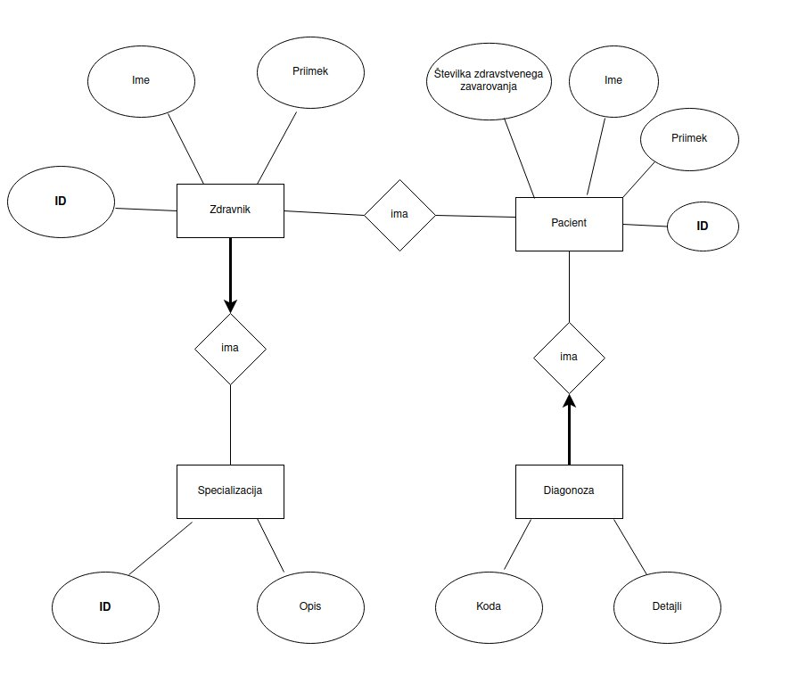

# OPB hospital


Projekt pri osnovi podatkovnih baz. Aplikacija uporabniku omogoča prijavo v sistem bolnišnice. 

Prijaviti se je mogoče kot:
* pacient
* zdravnik
* administrator

Pacient ima vpogled do svojih podatkov, zdravnikov in diagnoz. Če se prijavi zdravnik, mu je omogočen pogled vseh svojih pacientov in njihovih diagnoz. Ogleda si lahko tudi podrobnosti svoje specializacije. Zdravnik ima možnost v sistem dodati novega pacienta. Administrator ima pogled do vsega.



## Navodila za namestitev

### Namestitev Conda

1. Prenesite in namestite Conda z uradne spletne strani: [Conda namestitev](https://docs.conda.io/projects/conda/en/latest/user-guide/install/index.html)

### Ustvarjanje novega okolja

1. Odprite terminal.
2. Ustvarite novo okolje z imenom `project_env` in Python različico 3.10:
   ```sh
   conda create --name project_env python=3.10
    ```
3. Aktivirajte novo okolje:
    ```sh
    conda activate project_env
    ```
### Namestitev zahtev
1. Prepričajte se, da ste v aktiviranem okolju `project_env`.
2. Namestite zahteve iz datoteke `requirements.txt`:
    ```
    pip install -r requirements.txt
    ```

### Zagon aplikacije
1. Prepričajte se, da ste v aktiviranem okolju `project_env`.
2. Zaženite aplikacijo:
    ```
    python app.py
    ```

3. Odprite brskalnik in pojdite na naslov http://localhost:8080.

## Spletni dostop
* [](https://mybinder.org/v2/gh/matevzkusterle/OPB_hospital/main?urlpath=proxy/8081/) Aplikacija `bottle.py`

